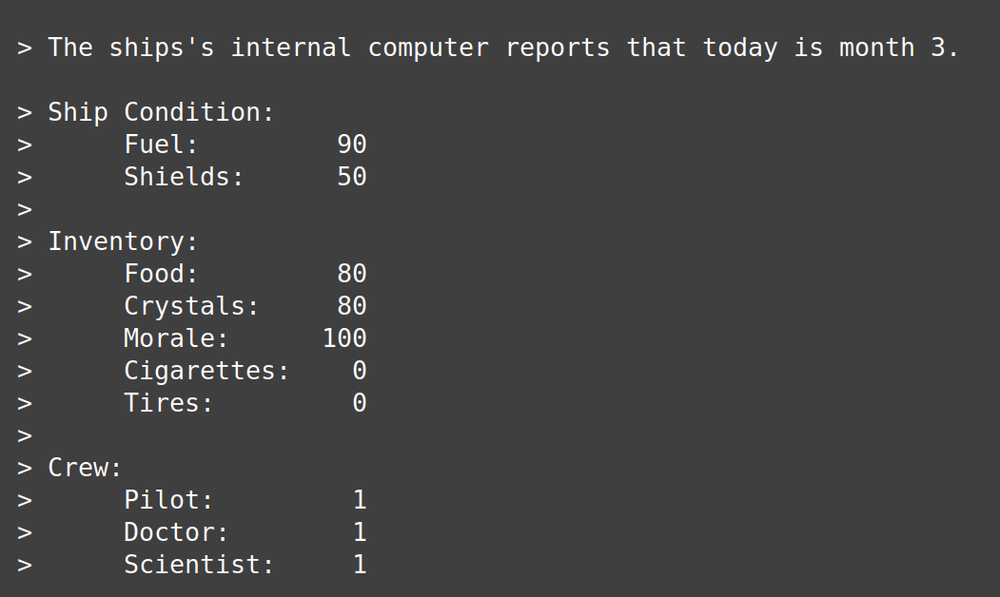

# Mars Trail: a text adventure game

- [Description](#description)
- [How to Play](#how-to-play)
- [Installation](#installation)

# Description
>You're headed off to Mars! The mission plan is a prudent Hohmann transfer orbit, meaning you'll arrive in a short 9 months. Make wise decisions while you're traveling to ensure you arrive in one piece.

# How to Play
Every month, an event will occur. You get to make a choice for how to respond; this choice will influence your spaceship, inventory, and crew. These variables will be displayed in the format below.

 

# Installation
Compile:
```./build.sh```

Execute fixed seed game:
```./Mars_Trail```

Execute specified seed game:
```./Mars_Trail 123```
